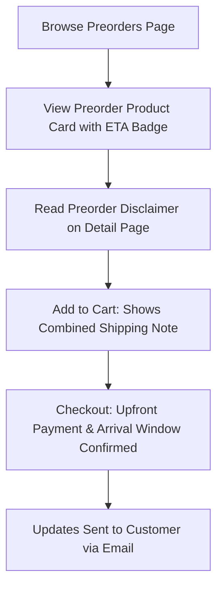

# Shopaholic Approved Website Strategy and Site Map

This document outlines the sitemap, page flow, and navigation layout for **Shopaholic Approved**. It ensures the platform is optimized for browsing, purchasing, preordering, and requesting custom collectibles while staying close to the live reference site's cute and premium boutique aesthetic.

---

## 1. Required Pages and Purposes

The new ecommerce site will support the following pages:

1. **Home (`/`)**
   - *Purpose:* Recreate the live site's welcoming, cute first impression. Showcases featured collections, preorders, trust-building disclaimers, and clear pathways to shop.
2. **Shop / Product Grid (`/shop`)**
   - *Purpose:* Primary catalog display with category filtering, search, and sorting.
3. **Product Detail Page (`/shop/[slug]`)**
   - *Purpose:* Displays product images, price, stock badges, specifications, shipping timelines, disclaimers, and the Add to Cart action.
4. **Preorders (`/preorders`)**
   - *Purpose:* Dedicated page showcasing upcoming collectibles available for reservation, with clear policy copy explaining arrival windows and rules.
5. **Catalog / Coming Soon (`/catalog`)**
   - *Purpose:* Teases upcoming releases, items on the horizon, or items currently out of stock. Includes a newsletter signup.
6. **Request an Item (`/request`)**
   - *Purpose:* Custom submission form for collectors hunting for specific, hard-to-find items not listed in the store.
7. **About Us (`/about`)**
   - *Purpose:* Tells the story of Shopaholic Approved and the inspiration behind the "Girl in the Green Scarf" logo.
8. **Contact Us (`/contact`)**
   - *Purpose:* Simple customer messaging form, support email address, and expected response times.
9. **FAQ (`/faq`)**
   - *Purpose:* Answers common questions regarding shipping, authenticity, packaging safety, preorders, and cancellations.
10. **Cart (`/cart`)**
    - *Purpose:* Side drawer and full-page layout summary of selected products, showing subtotals and preorder warning disclaimers.
11. **Checkout (`/checkout`)**
    - *Purpose:* Secure payment processing gateway integration page.
12. **Policies (Footer-only pages):**
    - **Shipping Policy (`/policies/shipping`):** Processing speeds, carrier options, and combined shipping rules.
    - **Refund Policy (`/policies/refunds`):** Damaged packages, preorder cancellation constraints, and returns.
    - **Privacy Policy (`/policies/privacy`):** Customer data security and cookie disclosures.
    - **Terms of Service (`/policies/terms`):** General terms of purchase and store guidelines.

---

## 2. Navigation Structure

### Header Navigation
Designed to stay sticky, lightweight, and clean on desktop and mobile viewports:
- **Logo (Left or Center):** Links to Home (`/`).
- **Menu Links:**
  - `Home` (`/`)
  - `Shop` (`/shop`)
  - `Preorders` (`/preorders`)
  - `Catalog` (`/catalog`)
  - `Request an Item` (`/request`)
  - `About` (`/about`)
  - `Contact` (`/contact`)
- **Cart Icon (Right):** Shows badge with item count. Clicking opens the slide-out Cart Drawer.

### Footer Navigation
Organized in professional, easy-to-scan columns at the bottom of all pages:
- **Column 1: Shop**
  - All Products (`/shop`)
  - Preorders (`/preorders`)
  - Coming Soon (`/catalog`)
  - Request an Item (`/request`)
- **Column 2: Customer Care**
  - About Us (`/about`)
  - Contact Us (`/contact`)
  - FAQ (`/faq`)
- **Column 3: Policies**
  - Shipping Policy (`/policies/shipping`)
  - Refund & Return Policy (`/policies/refunds`)
  - Privacy Policy (`/policies/privacy`)
  - Terms of Service (`/policies/terms`)
- **Bottom Bar:**
  - Copyright line (e.g., `© 2026 Shopaholic Approved. All rights reserved.`)
  - Independent collector shop disclaimer text.

---

## 3. Homepage Layout Plan
The homepage structure will recreate the original layout sequence, polished for an ecommerce store:

1. **Sticky Header:** Custom brand logo + main navigation + cart drawer trigger.
2. **Hero Banner Section:**
   - Large welcoming title: `"Welcome to Shopaholic Approved"` / `"Cute Collectibles, Shopaholic Approved"`
   - Subtitle: `"Find your next favorite collectible from our handpicked collection — curated for collectors who love the hunt."`
   - Primary Call-to-Action (CTA): `"Shop Now"` (links to `/shop`).
   - Secondary Call-to-Action (CTA): `"View Preorders"` (links to `/preorders`).
   - Background: Premium aesthetic image highlighting cute products with soft, matching opacity overlays.
3. **Featured Categories Strip:**
   - Grid cards representing categories: `Plush Charms`, `Blind Boxes`, `Plushies`, `Preorders`, `New Arrivals`, and `Collectibles`.
4. **Featured Products:**
   - Highlight of 4–8 popular or new arrival items in a clean card grid (includes image, name, price, badge, and view details action).
5. **Trust and Safety strip:**
   - Visual items: Secure Payments, Carefully Packed (bubble wrapped for box safety), Independent Authenticity Sourcing.
   - Independent Store Disclaimer.
6. **Request Banner ("Looking for something specific?"):**
   - Short headline with CTA link directing to `/request`.
7. **About Preview / Story Snippet:**
   - Explains the green scarf logo symbol and redirects to the full page `/about`.
8. **Contact CTA:**
   - Pathway for customers to reach out.
9. **Footer:** Directory links and policy pages.

---

## 4. Product Categories
Standard categorization across filters, navigation cards, and product data:
- **Plush Charms:** Dedicated category for cute collectible bag charms and plush accessories.
- **Blind Boxes:** Mystery collectible boxes from popular designers.
- **Plushies:** Soft toys, bag charms, and cute plush characters.
- **Preorders:** Future arrivals open for customer reservation.
- **Collectibles:** General collector figurines, art toys, and keychains.
- **New Arrivals:** Recently added catalog items.

---

## 5. Preorder Workflow & Policies

To ensure customer trust and transparency, preorders will follow this flow:

### Preorder Product Card & Detail Page Standard Copy:
- Clearly label estimated arrival times (e.g., `ESTIMATED ARRIVAL: Q3 2026`).
- Include the standard disclaimer block:
  > **Preorder Terms:** Preorder items are not currently in hand. Estimated arrival windows are supplier estimates and may experience shipping, customs, or manufacturing delays. Payment is charged upfront to secure your item. Cancellations are subject to our Refund Policy.

### Cart Rules:
- If a cart contains both preorder items and in-stock items, display a prominent notice:
  > **Note:** Orders containing both in-stock and preorder items will ship together once the preorder items arrive. If you want in-stock items shipped immediately, please place separate orders.

---

## 6. Request an Item Workflow
A dedicated custom sourcing service to help collectors obtain specific figures.
- **Form Path:** `/request`
- **Fields Required:**
  1. *Customer Name* (required)
  2. *Email Address* (required, validated format)
  3. *Collectible Item Name* (required)
  4. *Brand / Series* (e.g., popular art toy brands)
  5. *Reference Link or Image URL* (optional)
  6. *Estimated Budget* (optional)
  7. *Deadlines / Notes* (optional)
- **Workflow:**
  - Customer completes form.
  - Client side validates fields.
  - Submit button triggers server-side endpoint or form handler.
  - Displays a clean success message: `"Request received! We'll search our trusted suppliers and email you within 24-48 hours."`
